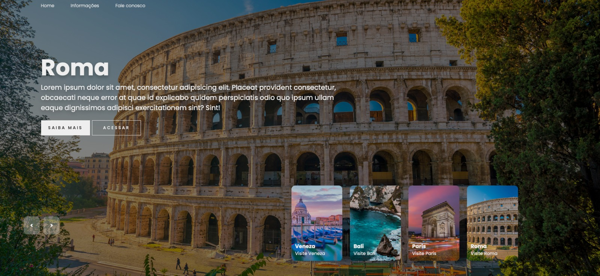

# 🌍 Slider de Viagens Interativo

Um slider de apresentação visual dinâmico e moderno construído com **HTML5, CSS3 e JavaScript Vanilla**. O projeto conta com transições fluídas, thumbnails interativas e efeitos de animação CSS ao avançar e voltar os cards de destinos.

---

## 🎨 Demonstração

<!-- COLOQUE SUA IMAGEM OU GIF ABAIXO -->


O projeto exibe um carrossel em tela cheia com destinos turísticos (como Bali, Paris, Roma e Veneza). Ao alternar os itens, os títulos, descrições e botões surgem com efeito de desfoque e deslizamento (*blur & slide animation*).

---

## 🚀 Funcionalidades

- **Navegação Bidirecional:** Botões para avançar (`next`) e voltar (`back`).
- **Animações Fluidas em CSS:** Transições suaves de imagem, texto e miniaturas utilizando `@keyframes`.
- **Efeito de Entrada de Conteúdo:** Animações sincronizadas por delays para título, descrição e botões.
- **Estrutura com Manipulação de DOM:** Uso nativo dos métodos `appendChild` e `prepend` para reordenar os elementos no HTML dinamicamente.
- **Tipografia Personalizada:** Integração com a fonte **Poppins** via Google Fonts.

---

## 🛠️ Tecnologias Utilizadas

- **HTML5:** Estruturação semântica da página.
- **CSS3:** Estilização, Flexbox, CSS Grid e animações com `@keyframes`.
- **JavaScript (ES6+):** Lógica de manipulação de elementos do DOM e controle de eventos.

---

## 📂 Estrutura de Arquivos

```text
├── index.html       # Estrutura HTML do slider
├── styles.css       # Estilos e animações do projeto
├── scripts.js       # Lógica e interatividade em JavaScript
└── assets/          # Pasta contendo as imagens dos destinos
    ├── demonstracao.gif # Imagem/GIF de preview do README
    ├── img1.jpg
    ├── img2.jpg
    ├── img3.jpg
    └── img4.jpg